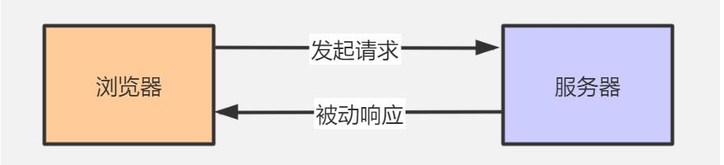
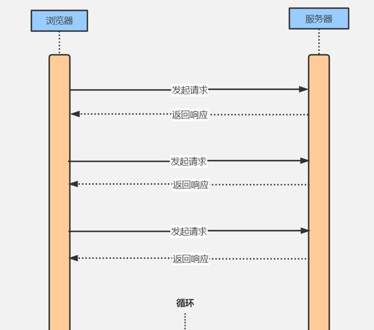
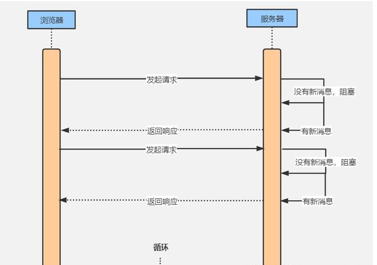
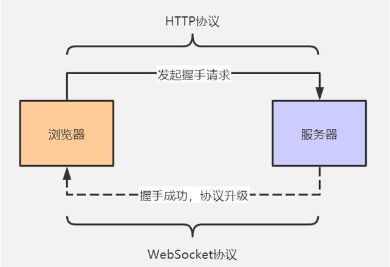
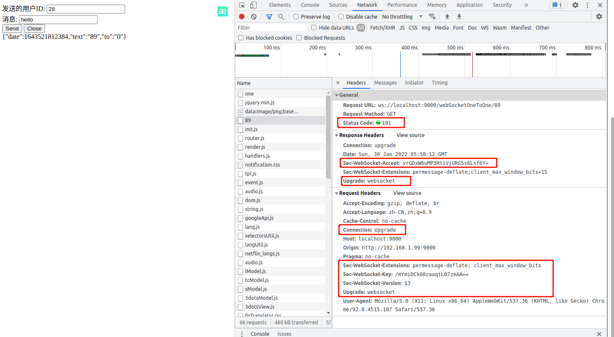

### 服务器怎么向客户端推送消息？

###### 目录

1. ###### web项目实现消息推送有哪几种方式？

2. ###### WebSocket是怎么建立起连接的？

3. ###### Spring Boot集成WebSocket实现消息推送

4. ###### 总结

#### 一、web项目实现消息推送有哪几种方式？

**传统的web项目浏览器与服务器基于HTTP协议进行交互，**一次交互流程总是先由浏览器发送一个HTTP请求到服务器，服务器收到请求后再返回响应数据。

**浏览器可以主动发起请求，服务器只能被动进行响应，服务器无法主动联系浏览器，这是HTTP最显著的特征之一。**

这样说服务器没有办法将消息主动推送到浏览器了？其实不然，换个思路既然服务器不能主动推送消息，那么就浏览器主动去取好了。

###### **1、ajax 轮询**

ajax轮询原理很简单，就是让浏览器每隔几秒钟就发送一次请求到服务器询问有没有新消息。

###### **2、Long Polling**

Long Polling的原理其实和ajax轮询类似，但是做了一些优化，Long Polling采用的是阻塞的方式。浏览器发起请求到服务器，此时如果服务器没有新消息就会一直阻塞不返回响应，直到有新消息才返回，浏览收到返回后，立即再次发起一个新的请求到服务器并继续等待响应。

**不管是ajax轮询还是Long Polling，了解流程之后可以看出这两种方式都算不上完美的方案。ajax轮询定时发请求，如果这个时候服务器没有新消息，那么这次连接做的就是无用功；Long Polling采用阻塞的方式虽然减少了连接的开销，但是服务器维持连接同样需要消耗资源，如果连接并发很大，服务器将会承受巨大压力。**

###### **3.WebSocket的出现就是为了彻底解决服务器向浏览器推送消息的问题。**

WebSocket是HTML5新增的一种通信协议。WebSocket支持双向通信的协议，它和HTTP协议一样通过TCP连接来进行数据传输。但是不同于HTTP协议的是基于WebSocket浏览器和服务器只需要完成一次握手，两者之间就直接建立起长连接，并可进行双向数据传输。

#### 二、WebSocket是怎么建立起连接的？

###### 1、WebSocket协议

WebSocket协议虽然跟HTTP协议是两个协议，但其实两者并不是毫无关系，**我更喜欢把WebSocket协议看作是对HTTP协议的一个补充，因为WebSocket建立连接的过程就是借助HTTP协议来完成握手的。**

###### 2、**WebSocket建立连接流程：**

浏览器向服务器发出一个HTTP请求，请求中除了包含常规的信息，还在请求头中表明希望将本次通信的HTTP协议升级为WebSocket协议。这个升级请求协议的过程就叫做握手。
服务端收到升级请求后会验证客户端发送的请求头信息，如果符合规范则同意将HTTP协议替换成 WebSocket协议，并向浏览器返回升级成功的信息。
双方建立起WenSocket连接就可以互相推送信息了。
在浏览器中看一下实际建立WebSocket连接的过程：

###### 3、**浏览器发送HTTP握手请求阶段：**

请求头Connection：Upgrade表明这是一个升级请求；
请求头Upgrade：websocket告诉服务器将请求升级成websocket协议；
请求头Sec-WebSocket-Version：13表明使用websocket协议的版本为13；
请求头Sec-WebSocket-Key校验key，防止恶意攻击者伪造请求；
服务器升级协议返回响应阶段：

响应状态码101表明该次升级请求被正确处理；
响应头Connection：Upgrade和Upgrade：websocket表明协议已升级成websocket；
响应头Sec-WebSocket-Accept服务端根据请求头Sec-WebSocket-Key计算得出，用于检验；

###### 4、WebSocket状态

通常在实例化一个websocket对象之后，客户端就会与服务器进行连接。但是连接的状态是不确定的，
于是用readyState属性来进行标识。它有四个值，分别对应不同的状态：
CONNECTING：值为0，表示正在连接；
OPEN：值为1，表示连接成功，可以通信了；
CLOSING：值为2，表示连接正在关闭；
CLOSED：值为3，表示连接已经关闭，或者打开连接失败。

###### 5、**总结**

服务器向客户端推送数据，可以通过HTTP协议以ajax轮询和Long Polling等客户端主动拉数据的方法实现，不管是ajax轮询还是Long Polling，都需要不断的发送请求，这会造成服务器资源的浪费。

WebSocket是一种支持双向通信的协议，通过一次HTTP升级请求完成websocket连接之后就可以多次通信了。